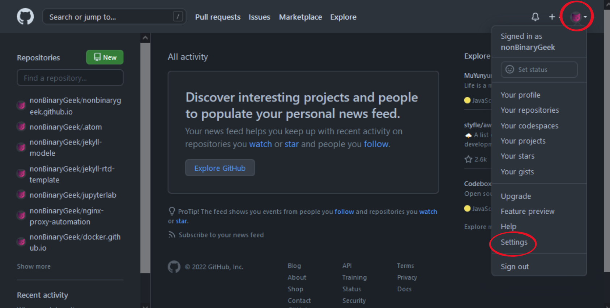
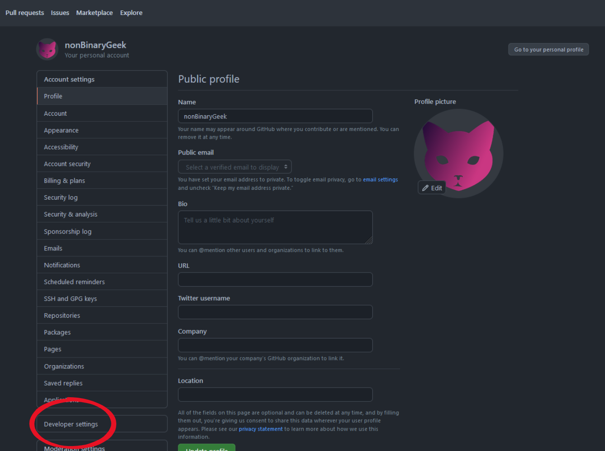
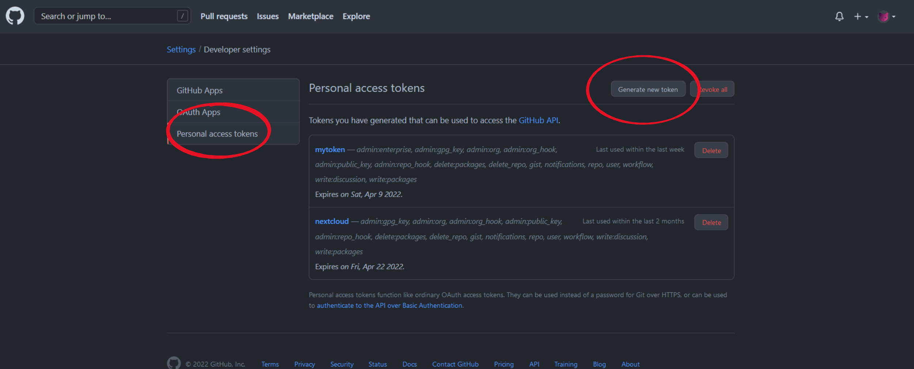

# Installation de l'environnement de travail

> Ce guide d'installation ce veut claire et concis. Il n'y est donc pas question du fonctionnement avancé et des raisons motivants l'utilisations d'une commande ou d'un programme face à un autre. Les références afin d'obtenir d'avantages d'informations sont présentées au bas de la page.

**PRÉREQUIS:**

- Vous avez un compte GitHub. Si ce n'est pas le cas, créez votre compte en suivant [ce lien](https://github.com/signup?ref_cta=Sign+up&ref_loc=header+logged+out&ref_page=%2F&source=header-home).

Options d'installation:

- **(OPTION 01) Windows Subsystem for Linux - WSL**
- **(OPTION 02) Linux: Debian ou Ubuntu**


<!-- MarkdownTOC lowercase_only_ascii="true" depth=3 autolink="true" bracket="round" -->

- [(OPTION 01) Windows Subsystem for Linux](#option-01-windows-subsystem-for-linux)
  - [Installation du logiciel WSL](#installation-du-logiciel-wsl)
- [(OPTION 01 et OPTION 02) WSL et Linux](#option-01-et-option-02-wsl-et-linux)
  - [Configuration de GitHub](#configuration-de-github)
  - [Préparation de GitHub Pages](#préparation-de-github-pages)
  - [Création d'un Authentification TOKEN](#création-d'un-authentification-token)
  - [(Optionnel) OPTION 01 SEULEMENT](#optionnel-option-01-seulement)
- [(OPTION 01 et OPTION 02) Installation](#option-01-et-option-02-installation)
  - [Installation de Jekyll](#installation-de-jekyll)
  - [Clonage de la Repo](#clonage-de-la-repo)
  - [Visualisation du siteweb](#visualisation-du-siteweb)

<!-- /MarkdownTOC -->

##  (OPTION 01) Windows Subsystem for Linux

### Installation du logiciel WSL

Afin d'utiliser cette option sous Windows, il suffit de l'activer dans les *Windows Features*. Vous pouvez faire une recherche dans la barre de recherche windows en y inscrivant : « *Turn Windows Features on or off* ». Il est aussi possible de faire les installation nécessaire simplement à partir de PowerShell en tant qu'Administrateur.

```powershell
wsl --install
```

Redémarrer l'ordinateur. La distribution installé par défaut est Ubuntu. Advenant un problème de connection internet - résolution DNS, ajouter directement les serveurs DNS dans le fichier `/etc/resolv.conf` tel que `nameserver 8.8.8.8`. Se fichier à tendance mal se générer et donc à priver le système de sa connection internet.

Une fois l'ordinateur redémarré, il suffit de lancer Ubuntu et de suivre la courte installation. 

> Note: La distribution Ubuntu est disponible dans le Microsoft Store déjà présent sur l'ordinateur advenant une erreur lors de l'installation.

Si vous préférez une autre distribution, vous pouvez utiliser la commande suivante dans PowerShell afin d'obtenir une liste des distributions disponibles.

```powershell
wsl --list --online
```


## (OPTION 01 et OPTION 02) WSL et Linux

### Configuration de GitHub

Une fois que WSL est installé, ou que notre machine Debian ou ubuntu est fonctionnelle, on peut installer `git` sur notre système.

```shell
sudo apt update && sudo apt upgrade -y
sudo apt install git -y
```


Pour configurer votre espace de travail Git, ouvrez une ligne de commande pour la distribution dans laquelle vous travaillez et définissez votre nom avec la commande suivante (en remplaçant "**your name**" par votre nom d'utilisateur et "**your email**" par l'adresse courriel associée à votre compte) : 

```sh
git config --global user.name "Your Name"
git config --global user.email "youremail@domain.com"
```


### Préparation de GitHub Pages

Afin de pouvoir publier notre siteweb sous GitHub Pages, il faut créer une nouvelle repo qui aura le format suivant:

**<your.username>.github.io**


### Création d'un Authentification TOKEN

Parfois, il arrive que GitHub soit restrictif lorsque l'on tente de modifier une *repo* qui nous appartient. À ce moment, il nous est impossible d'utiliser notre email et notre mot de passe lors des modifications. Il est donc préférable de créer un *token* d'authentification que l'on aura qu'à copier coller lorsqu'un mot de passe sera exigé. Afin de créer un *token*, il faut se connecter à [GitHub](https://github.com/login), se diriger sous nos *paramètres de compte*, descendre au bas de la page et selectionner les *Paramètres de Developpeur*.










### (Optionnel) OPTION 01 SEULEMENT

[Git Credential Manager (GCM)](https://github.com/GitCredentialManager/git-credential-manager) vous permet de vous authentifiez à un serveur Git distant. Ainsi, il est possible de mettre en place un méchanisme d'authentification permettant d'utiliser votre compte via la ligne de commande.

Pour configurer GCM en concordance avec une distribution WSL, ouvrez votre distribution sous WSL et saisissez cette commande: 

```sh
git config --global credential.helper "/mnt/c/Program\ Files/Git/mingw64/libexec/git-core/git-credential-manager-core.exe"
```

Pour plus de détails relativement à l'[authentification sous GitHub](https://docs.github.com/en/authentication).


## (OPTION 01 et OPTION 02) Installation

### Installation de Jekyll

**Installer les dépendances**

Installez Ruby et les autres [prérequis ](https://jekyllrb.com/docs/installation/#requirements): 

```sh
sudo apt-get install ruby-full build-essential zlib1g-dev
```

**IMPORTANT**: Évitez d'installer les futures packages RubyGems (appelés gems) en tant qu'utilisateur root. Préférablement, configurez un répertoire d'installation de gem pour votre compte utilisateur auxquels nous ajouterons les `path` nécessaires dans notre fichier `~/.bashrc`.

```sh
echo '# Install Ruby Gems to ~/gems' >> ~/.bashrc
echo 'export GEM_HOME="$HOME/gems"' >> ~/.bashrc
echo 'export PATH="$HOME/gems/bin:$PATH"' >> ~/.bashrc
source ~/.bashrc
```

**Installer les gems Jekyll et Bundler**

Enfin, installez Jekyll et Bundler : 

```ruby
gem install jekyll bundler
```


### Clonage de la Repo

Afin d'obtenir une copie du Site, il suffit d'utiliser la commande git. Par contre, il est aussi préférable de se créer un répertoire qui servira d'espace de travail. Ici, nous avons créé un répertoire nommé `~/git`.

```sh
cd ~/
mkdir git
cd git
```

Enfin, on peut cloner la *repo* située sous [ce lien](https://github.com/nonBinaryGeek/jekyll-modele.git).

```sh
git clone https://github.com/nonBinaryGeek/jekyll-modele.git
  Cloning into 'jekyll-modele'...
  remote: Enumerating objects: 443, done.
  remote: Counting objects: 100% (443/443), done.
  remote: Compressing objects: 100% (311/311), done.
  remote: Total 443 (delta 130), reused 424 (delta 113), pack-reused 0
  Receiving objects: 100% (443/443), 3.11 MiB | 9.91 MiB/s, done.
  Resolving deltas: 100% (130/130), done.
```

Ensuite, nous devons indiquer au répertoire que son origine sera la notre. Il est important de changer l'adresse URL ci-dessous afin qu'elle corresponde à la repo que nous avons créer lors de l'étape

```sh
git remote set-url origin https://github.com/<your.username>/<your.username>.github.io
```


### Visualisation du siteweb

Afin de prévisualiser notre site web, on se dirige dans le répertoire tout juste créer.

```sh
ls
jekyll-modele
cd jekyll-modele/
ls -lt
drwxr-xr-x 5 phil phil 4096 Jan  9 19:34 assets
-rw-r--r-- 1 phil phil  841 Jan  9 19:34 package.json
-rw-r--r-- 1 phil phil   25 Jan  9 19:34 requirements.txt
-rw-r--r-- 1 phil phil 2571 Jan  9 19:34 update.sh
-rw-r--r-- 1 phil phil  897 Jan  9 19:34 webpack.config.js
drwxr-xr-x 4 phil phil 4096 Jan  9 19:34 _sass
drwxr-xr-x 2 phil phil 4096 Jan  9 19:34 About
-rw-r--r-- 1 phil phil    0 Jan  9 19:34 CNAME
drwxr-xr-x 5 phil phil 4096 Jan  9 19:34 Documentations
-rw-r--r-- 1 phil phil   89 Jan  9 19:34 Gemfile
-rw-r--r-- 1 phil phil 8150 Jan  9 19:34 Gemfile.lock
-rw-r--r-- 1 phil phil 1091 Jan  9 19:34 LICENSE
-rw-r--r-- 1 phil phil 1414 Jan  9 19:34 Makefile
-rw-r--r-- 1 phil phil 2440 Jan  9 19:34 README.md
-rw-r--r-- 1 phil phil 1359 Jan  9 19:34 _config.yml
drwxr-xr-x 7 phil phil 4096 Jan  9 19:34 _includes
drwxr-xr-x 3 phil phil 4096 Jan  9 19:34 _layouts
```

On peut utiliser l'utilitaire `jekyll`, une fois dans le répertoire, afin de créer temporairement le siteweb qui sera accessible à l'adresse `http://127.0.0.1:4000` .

```sh
bundle exec jekyll serve

Configuration file: /home/phil/git/jekyll-modele/_config.yml
            Source: /home/phil/git/jekyll-modele
       Destination: /home/phil/git/jekyll-modele/_site
 Incremental build: disabled. Enable with --incremental
      Generating...
      Remote Theme: Using theme nonbinarygeek/nonbinarygeek.github.io
   GitHub Metadata: No GitHub API authentication could be found. Some fields may be missing or have incorrect data.
                    done in 15.556 seconds.
/home/phil/gems/gems/pathutil-0.16.2/lib/pathutil.rb:502: warning: Using the last argument as keyword parameters is deprecated
                    Auto-regeneration may not work on some Windows versions.
                    Please see: https://github.com/Microsoft/BashOnWindows/issues/216
                    If it does not work, please upgrade Bash on Windows or run Jekyll with --no-watch.
 Auto-regeneration: enabled for '/home/phil/git/jekyll-modele'
    Server address: http://127.0.0.1:4000
  Server running... press ctrl-c to stop.
```

**IMPORTANT**: La commande `bundle exec jekyll serve` accepte les paramètres `--port` et `--host`. Si l'on utilise une machine distante ou une machine virtuelle sans interface graphique pour travailler sur notre sitweb, on peut utiliser ces deux paramètres afin d'obtenir l'accès à notre site.

Par exemple, si mon installation se trouve sur une VM à l'adresse `192.168.99.135`, je peux utiliser la commande suivante:

```sh
bundle exec jekyll server --port 4001 --host 192.168.99.135
```

Le résultat ressemblera alors au suivant:

```sh
 Auto-regeneration: enabled for '/home/phil/git/jekyll-modele'
    Server address: http://192.168.99.135:4001
  Server running... press ctrl-c to stop.
```

On pourra alors accéder au siteweb via un browser en tappant l'adresse IP combinée au port `http://192.168.99.135:4001`.
